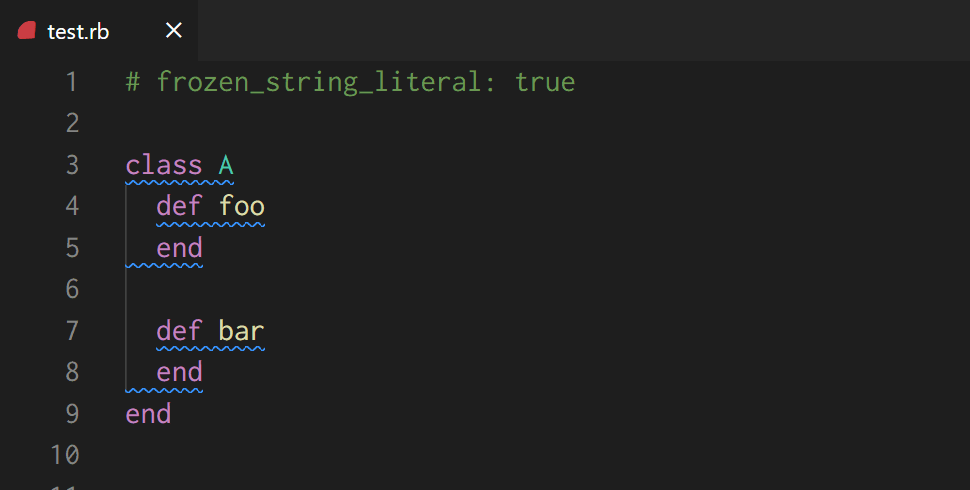
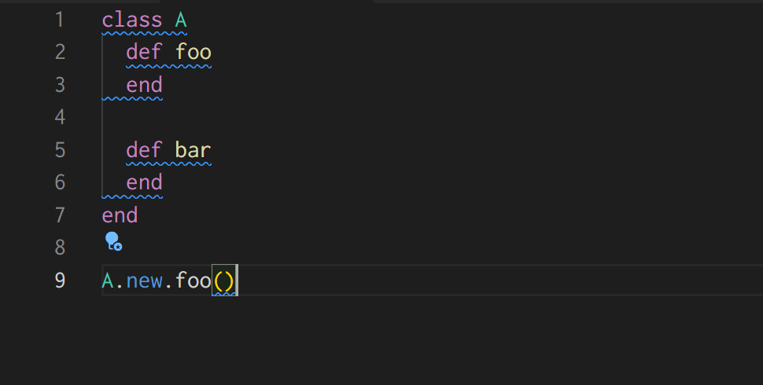
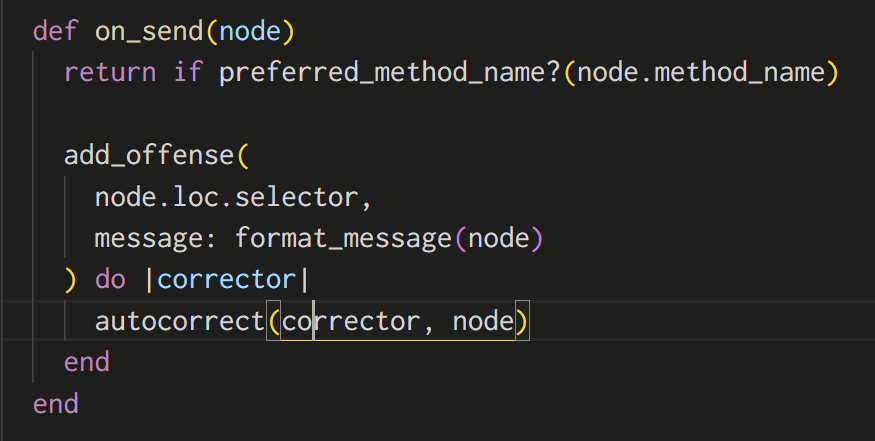
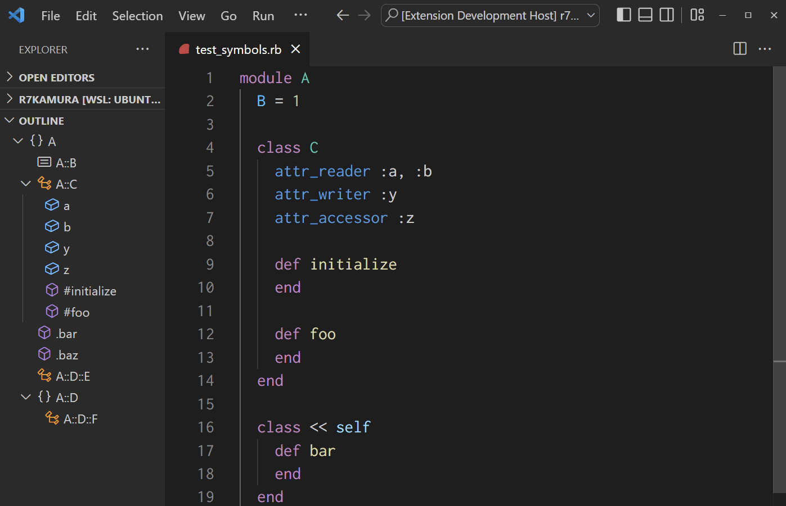

# Rucoa

[](https://github.com/r7kamura/rucoa/actions/workflows/test.yml)

Language server for Ruby.

## Usage

Install both rucoa gem and [vscode-rucoa](https://marketplace.visualstudio.com/items?itemName=r7kamura.vscode-rucoa) extension, then open your Ruby project in VSCode.

To install rucoa gem, if your project is managed by bundler, add to your Gemfile:

```ruby
# Gemfile
gem 'rucoa'
```

If bundler is not being used to manage dependencies, simply install the gem:

```bash
gem install rucoa
```

## Features

### Diagnostics

Displays RuboCop offenses and provides Quick Fix action for autocorrection.



### Formatting

Run "Format Document" command or enable "Format On Save" in the settings to autocorrect RuboCop offenses.



### Selection

Run "Expand Selection" command to select appropriate ranges.



### Symbol

See Outline section in the explorer panel to see document symbols in the current file, or run "Go to Symbol" command to search for symbols.

This extension supports the folowiing types of symbols:

- class
- module
- constant
- instance method
- singleton method (a.k.a. class method)
- attribute (attr_accessor, attr_reader, and attr_writer)



## Experimental features

### Completion

Provides completion items for constant names and method names.

### Definition

Provides "Go to Definition" command to jump to the definition.

### Hover

Shows documentation for the symbol under the cursor.

### Signature help

Shows method signature help when you start to type method arguments like `"100".to_i(`.

## Coming soon

- Highlight
- Semantic Tokens
